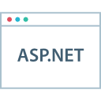

### Islam Eldemery 

I'm a web developer and I love coding so much. I have used many technologies throughout a decade of professional experience in programming and here you'll find bits of the things I liked, things I developed for fun, and things that I use commonly in different applications that you may find helpful.

- **Smartint**: [Dynamics CRM gets Document Management with Dropbox.](https://github.com/idemery/Smartint)
- **Multiplayer Snake Game**: [A multiplayer snake game using .NET 5 Blazor and SignalR that supports rooms and multiple games.](https://github.com/idemery/MultiPlayerSnakeGame)
- **Mat Loader**: [A global Angular progress loader that uses HTTP interceptor and gives success/error feedback.](https://github.com/idemery/idm-mat-loader)
- **Chat and Cast**: [.NET Windows Forms Chat and Screen Casting using WCF Duplex.](https://github.com/idemery/NetWinChatAndCast)
- **WPF WCF Chat**: [Chatting app based on "Chat and Cast" and "Dynamic Modules".](https://github.com/idemery/WPFWCFChat).
- **OData Table**: [Simplifies quering OData V4 APIs using odata-query, odata-data-source, and material-dynamic-table.](https://github.com/idemery/mat-odata-table)
- **Chess For Kids**: [Helps beginner chess players to know a piece's allowed moves and threats.](https://github.com/idemery/ChessForKids)

           
